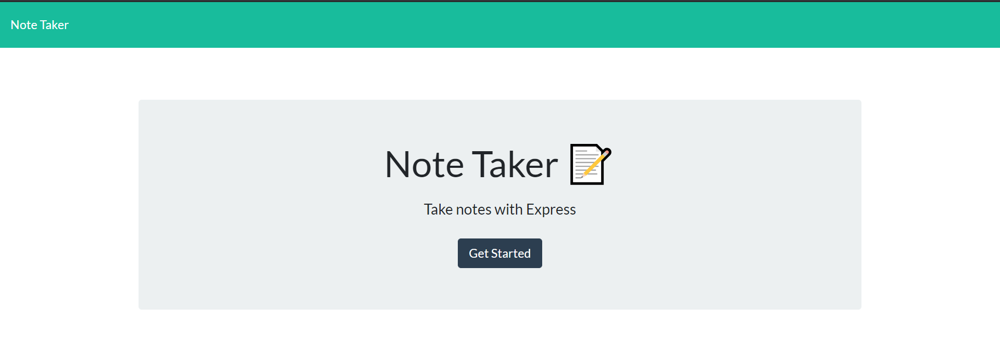
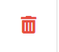
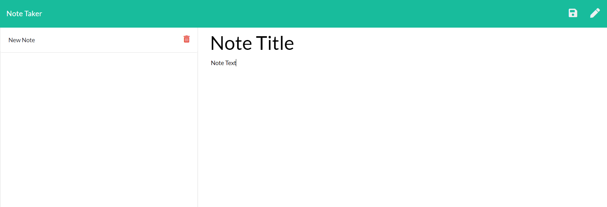

# Express-NoteTaker

## The App

* When first opening the app the user will be directed to the homepage. When ready to begin taking notes, the user will select "Get Started".

* Once in the app the user will select the pencil icon in the top write corner to begin making a new note.

* The user will supply the title to the note and in the box below, the note the user needs to make.

* When finished the user will select the floppy disc icon, next to the pencil icon, in the top right corner to save their note.

* Once the note is saved it will be stored on the left side of the page with the title showing.

* The notes will be listed in the order which they were saved.

* To delete any note, the user simply needs to click the trashcan icon on the saved note.

* Once the user has finished no, the final result should look like the below image.

